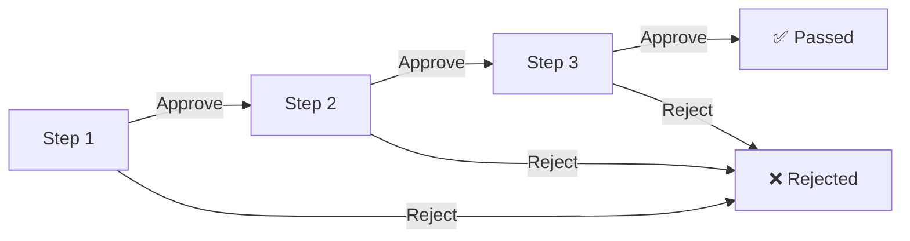

Grant Flows define the approval rules for device connection authorization requests — who reviews, how many tiers, and under what conditions the request is approved or rejected.

## Flow Rules


### Basic Structure

Each grant application ([Accessible Device Grant](/en/admin/connection-auth/device-grants/)) contains **one or more** User Grant Groups (UGGs), each serving as an **approval step** executed **in order**.

```
Grant Application: User "jdoe" → Device "dev-1"
  ├─ Step 1: UGG-A (e.g., Department Manager group)
  ├─ Step 2: UGG-B (e.g., Security Review group)
  └─ Step 3: UGG-C (e.g., System Administrator group)
```

### Per-Step Decision: Any Member Can Approve

Within a step, approval from **any single member** of that step's UGG passes the step, and the flow automatically advances to the next step.

| UGG Member | Action | Result |
|------------|--------|--------|
| Member A | Approve ✅ | → Step passed, advance to next step |
| Member B | No action | — |

> Each step uses a "first-to-act" mechanism: the decision of the first member to review becomes the final result for that step.

### Overall Result: AND-Gate

All steps must be approved for the entire application to pass. If any step is rejected, the entire application is marked as **rejected** and the flow terminates.



### Cross-Group Participation

A single user can belong to multiple grant groups. If a user is a member of both UGG-A (Step 1) and UGG-C (Step 3), that user can perform reviews in both steps independently.

## Step Configuration When Creating a Grant

When creating a new grant application in [Accessible Device Grants](/en/admin/connection-auth/device-grants/), you must specify the approval steps:

1. **Select User** — The user to authorize
2. **Select Device** — The target device
3. **Configure Approval Steps** — Select User Grant Groups in order as Step 1, Step 2, Step 3...
4. **Configure Authorization Parameters** — Credentials, validity period, login restrictions, etc.

Once created, the application enters [Pending Grants](/en/admin/connection-auth/pending-grants/) and begins sequential review.
