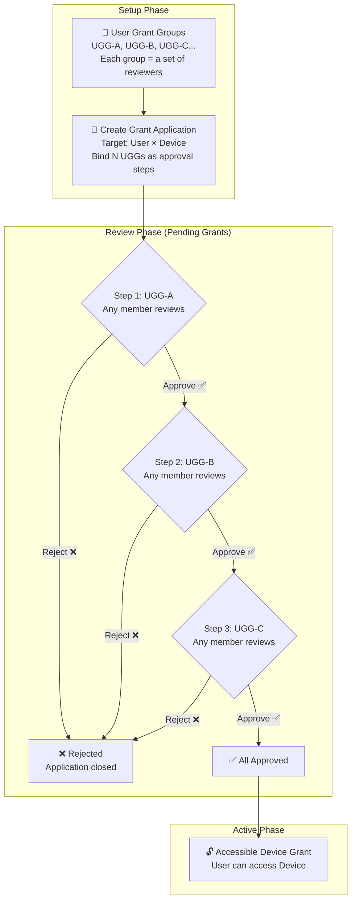

SOSI provides two approaches for granting device access:

| Approach | Mechanism | Use Case |
|----------|-----------|----------|
| **Direct Assignment** | Administrators assign users to devices directly, without an approval process | Small organizations, no layered approval needed |
| **Connection Authorization** | Requires a multi-step approval workflow; grant group members must approve each step before access is granted | Large organizations requiring layered approval |

This section covers the latter — Connection Authorization is an advanced feature designed for organizations that need a layered approval process.

## Authorization Lifecycle

## Four Sub-Modules

| Module | Description |
|--------|-------------|
| [User Grant Groups](/en/admin/connection-auth/grant-groups/) | Manage the reviewer sets for each approval step — each group represents one approval tier |
| [Grant Flows](/en/admin/connection-auth/grant-flows/) | Define the approval chain rules: number of steps, ordering, AND-gate rejection mechanism |
| [Accessible Device Grants](/en/admin/connection-auth/device-grants/) | List of grants that have passed all approval steps and are now active |
| [Pending Grants](/en/admin/connection-auth/pending-grants/) | Applications under review — the current step awaits review from the corresponding group members |
