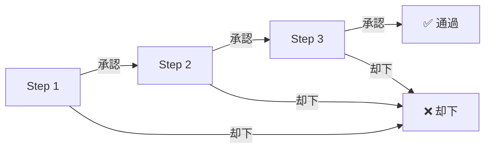

承認フロー（Grant Flow）は、デバイス接続認可申請の承認ルールを定義します — 誰が審査するか、何段階か、どのような条件で承認または却下されるか。

## フロールール


### 基本構造

各認可申請（[有効なデバイス認可](/ja/admin/connection-auth/device-grants/)）には**1つ以上**のユーザー承認グループ（UGG）が含まれ、各UGGは**承認ステップ**として**順次実行**されます。

```
認可申請：User "jdoe" → Device "dev-1"
  ├─ Step 1: UGG-A（例：部門長グループ）
  ├─ Step 2: UGG-B（例：セキュリティ審査グループ）
  └─ Step 3: UGG-C（例：システム管理者グループ）
```

### ステップ内の決定：任意のメンバーが承認可能

ステップ内では、そのステップのUGGの**任意の1メンバー**の承認でステップが通過し、フローは自動的に次のステップに進みます。

| UGG メンバー | アクション | 結果 |
|-------------|-----------|------|
| メンバー A | 承認 ✅ | → ステップ通過、次ステップへ |
| メンバー B | 未操作 | — |

> 各ステップは「先着順」メカニズムを採用：最初に審査したメンバーの決定がそのステップの最終結果となります。

### 全体結果：ANDゲート

すべてのステップが承認されて初めて申請全体が通過します。いずれかのステップが却下されると、申請全体が**却下**としてマークされ、フローは終了します。



### クロスグループ参加

1人のユーザーが複数の承認グループに所属できます。ユーザーがUGG-A（Step 1）とUGG-C（Step 3）の両方のメンバーである場合、そのユーザーは両方のステップで独立して審査を行うことができます。

## 認可作成時のステップ設定

[有効なデバイス認可](/ja/admin/connection-auth/device-grants/)で新しい認可申請を作成する際、承認ステップを指定する必要があります：

1. **ユーザーを選択** — 認可するユーザー
2. **デバイスを選択** — 対象デバイス
3. **承認ステップの設定** — ユーザー承認グループを Step 1, Step 2, Step 3... の順に選択
4. **認可パラメータの設定** — 資格情報、有効期間、ログイン制限など

作成後、申請は[承認待ち認可](/ja/admin/connection-auth/pending-grants/)に入り、順次審査が開始されます。
