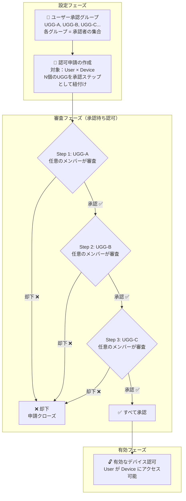

SOSI はデバイスアクセスを付与するための2つのアプローチを提供します：

| アプローチ | 仕組み | 利用シーン |
|-----------|--------|------------|
| **直接割り当て** | 管理者がユーザーをデバイスに直接割り当て、承認プロセスなし | 小規模組織、階層的承認不要 |
| **デバイス接続認可** | 複数ステップの承認ワークフローが必要。承認グループメンバーが各ステップを承認した後にアクセスが付与される | 階層的承認が必要な大規模組織 |

本セクションでは後者について説明します。デバイス接続認可は、階層的な承認プロセスを必要とする組織向けに設計された高度な機能です。

## 認可ライフサイクル

## 4つのサブモジュール

| モジュール | 説明 |
|-----------|------|
| [ユーザー承認グループ](/ja/admin/connection-auth/grant-groups/) | 各承認ステップの審査者セットを管理 — 各グループが1つの承認段階を表す |
| [承認フロー](/ja/admin/connection-auth/grant-flows/) | 承認チェーンのルールを定義：ステップ数、順序、ANDゲート却下メカニズム |
| [有効なデバイス認可](/ja/admin/connection-auth/device-grants/) | すべての承認ステップを通過し、有効になった認可の一覧 |
| [承認待ち認可](/ja/admin/connection-auth/pending-grants/) | 審査中の申請 — 現在のステップが対応グループメンバーによる審査を待機中 |
