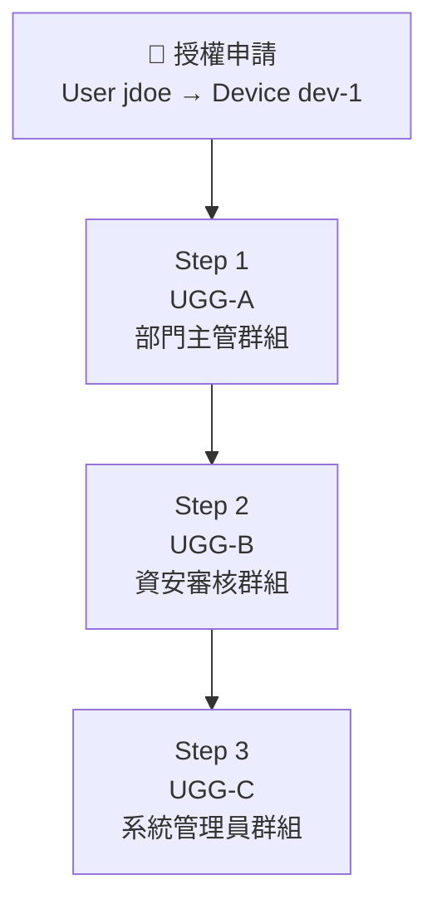
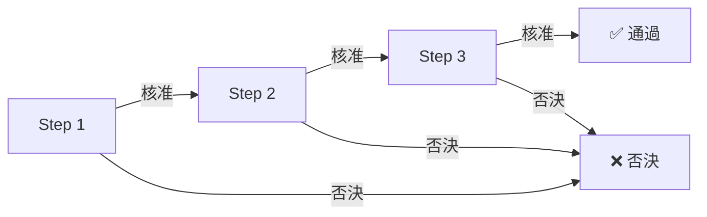

授權流程（Grant Flow）定義了裝置連線授權申請的審核規則——誰來審、審幾關、什麼情況下通過或否決。

## 流程規則

### 基本結構

每一個授權申請（[accessible_device_grant](/zh/admin/connection-auth/device-grants/)）包含 **1 個以上**的使用者授權群組（UGG），每個 UGG 作為一個**審核步驟**（Step），並**依序執行**。

### 步驟內決策：任一人核准即通過

在一個步驟中，該 UGG 的**任一成員**核准，該步驟即視為通過，流程自動進入下一步驟。

| UGG 成員 | 動作 | 結果 |
|----------|------|------|
| 成員 A | 核准 ✅ | → 步驟通過，進入下一步 |
| 成員 B | 未操作 | — |

> 步驟的核准採用「先到先決」機制：第一位進行審核的成員其決定即為該步驟的最終結果。

### 整體結果：AND-gate

所有步驟都必須核准，整筆申請才算通過。任一步驟遭否決，整筆申請即標記為**否決**，流程終止。

### 跨群組參與

同一使用者可同時屬於多個授權群組。若使用者同時是 UGG-A（Step 1）和 UGG-C（Step 3）的成員，則該使用者可在這兩個步驟**分別**進行審核。

## 建立授權申請時的步驟設定

在[可行裝置授權](/zh/admin/connection-auth/device-grants/)頁面建立新的授權申請時，需指定審核步驟：

1. **選取使用者（User）** — 欲授權的對象
2. **選取裝置（Device）** — 目標連線裝置
3. **設定審核步驟** — 依序選取使用者授權群組作為 Step 1, Step 2, Step 3...
4. **設定授權參數** — 憑證、有效時間、登入限制等

建立後，該申請即進入[待審裝置授權](/zh/admin/connection-auth/pending-grants/)，開始依序審核。
