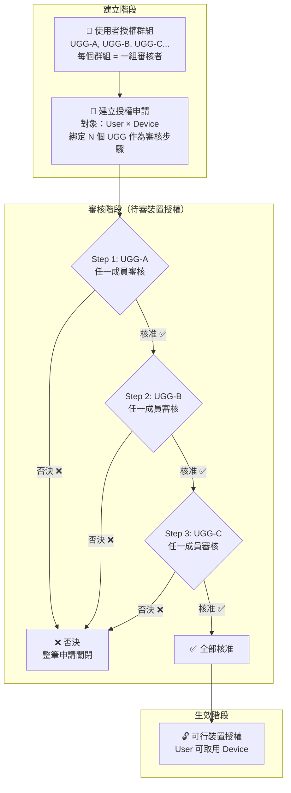

SOSI 提供兩種裝置指派途徑：

| 途徑 | 機制 | 適用場景 |
|------|------|----------|
| **直接指派** | 管理員直接將使用者指派到裝置，無需審核 | 小型組織、無需分層審核 |
| **裝置連線授權** | 需經過多步驟審核流程，由授權群組成員逐關核准後方可取用裝置 | 需要分層審核的大型組織 |

本節說明後者 — 「裝置連線授權」是為有分層審核需求的組織設計的進階功能。

## 授權生命週期

## 四個子功能模組

| 模組 | 說明 |
|------|------|
| [使用者授權群組](/zh/admin/connection-auth/grant-groups/) | 管理審核步驟的參與者集合——每個群組代表一關審核 |
| [授權流程](/zh/admin/connection-auth/grant-flows/) | 定義審核鏈規則：步驟數量、順序、AND-gate 否決機制 |
| [可行裝置授權](/zh/admin/connection-auth/device-grants/) | 已走完所有審核步驟、核准生效的授權列表 |
| [待審裝置授權](/zh/admin/connection-auth/pending-grants/) | 審核中的申請——當前步驟正等待對應群組成員審核 |
